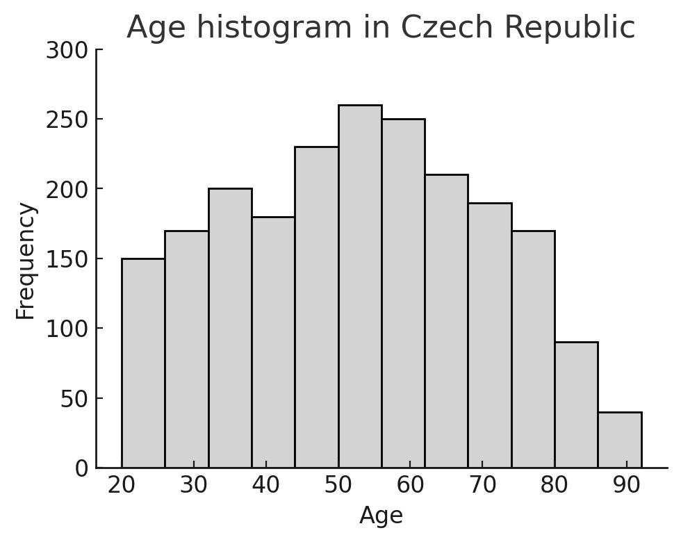
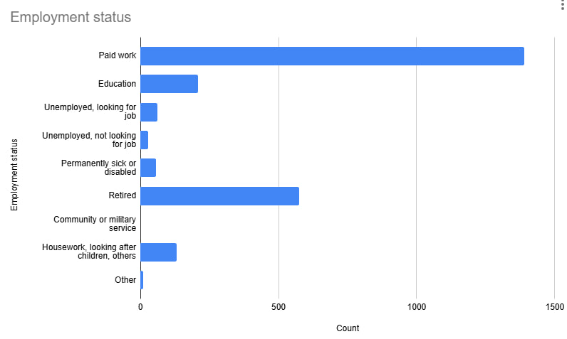
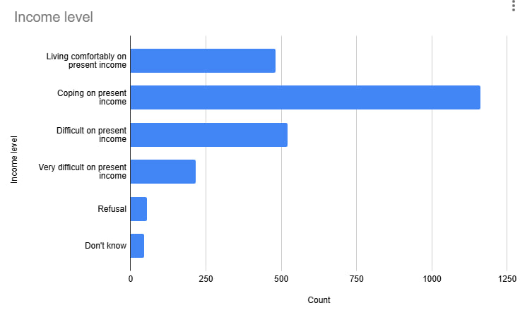
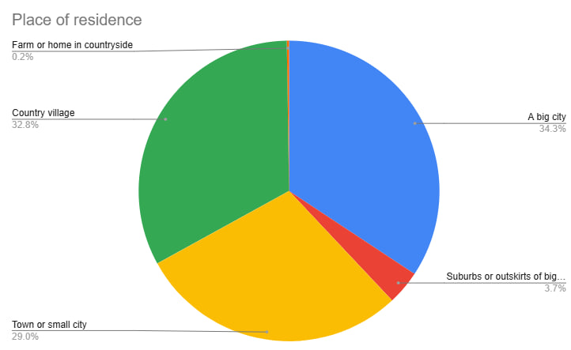
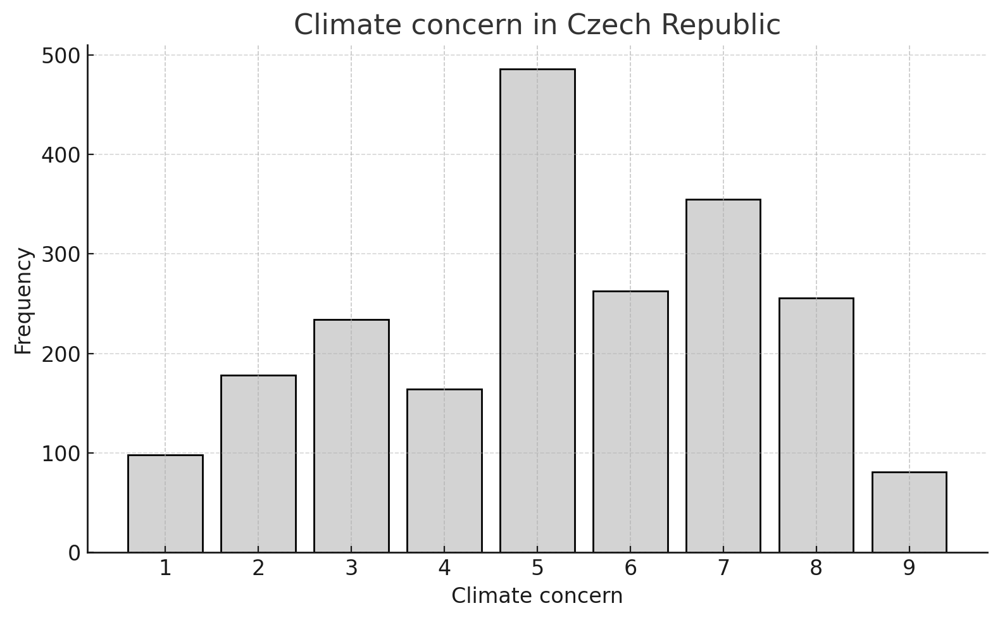
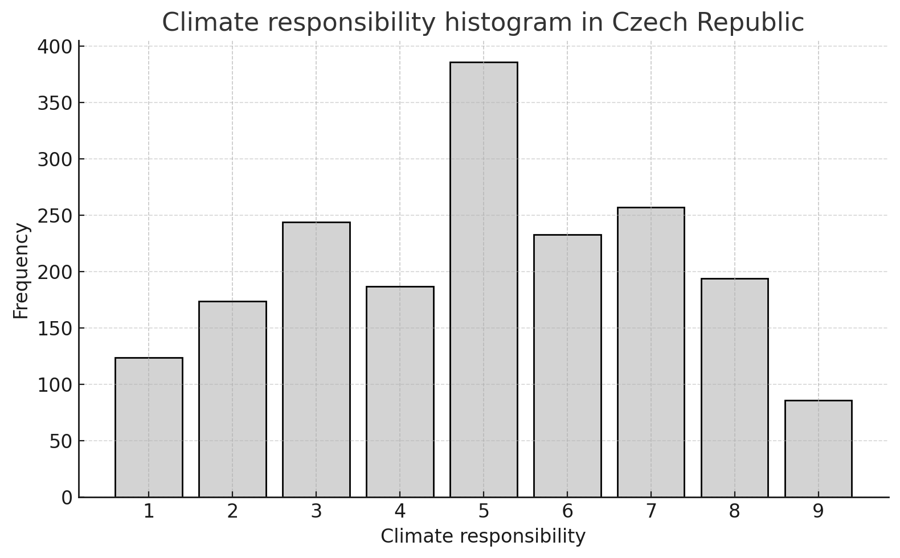
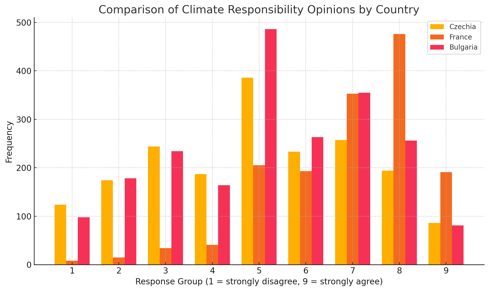

# University project - Climate concern in Czech Republic

## Main Objective

The purpose of this project is to explore and explain how various personal factors influence climate change attitudes in a selected country, using multiple linear regression.

This analysis is based on data from the [The European Social Survey ](http://www.europeansocialsurvey.org/)

A spreadsheet was also created to visualize some of the graphs.:
[Spreadsheet with tables](https://docs.google.com/spreadsheets/d/1YG3ZQdxRdu9yBhpzajHtwnG32fPJWxOF-rZwP2dZCOg/edit?gid=0#gid=0)

## Task 1

**My task is to find out how strongly respondents feel personally responsible for helping to reduce climate change.**

### 1. This analysis focuses on the Czech Republic

The chart below shows the **age distribution** of all respondents:

- The youngest participant was **20**, and the oldest was **90**
- The **average** age was **48 years**
- The majority of respondents were between **40 and 60 years old**
- Fewer people were under **30** or over **75**

#### Education level

Survey respondents reported their level of education, categorized according to the ISCED system:

- ES-ISCED I – Less than lower secondary education
- ES-ISCED II – Lower secondary education
- ES-ISCED IIIb – Lower tier upper secondary education
- ES-ISCED IIIa – Upper tier upper secondary education
- ES-ISCED IV – Advanced vocational or sub-degree level
- ES-ISCED V1 – Lower tertiary education, such as a Bachelor's degree
- ES-ISCED V2 – Higher tertiary education, Master's level or higher

The information about the ISCED system is taken from:

https://github.com/MarthaBog/Climate_Impact_University/blob/main/ESS10_2020questionnaires_EE_est.pdf

- **Most respondents** completed **lower or upper tier upper secondary education (ISCED IIIb and IIIa)**
- A smaller group was with **tertiary degrees (Bachelor’s or Master’s)**
- And the smallest group has **no formal education** or did not respond

#### Employment Status  

Here's how employment is distributed:

- The **majority** were in **paid work**
- The **second** largest group was **retired**
- Others were students, unemployed, permanently sick/disabled, involved in housework/caregiving, or in military/community service

#### Income level 

Respondents rated their financial situation:

- The largest group reported **"coping on present income"**
- A substantial number were **"living comfortably"**
- Some found it **"difficult"** or **"very difficult"** to manage

#### Place of Residence

- **Big city** – the largest group.
- **Country village** group has second place
- **Town or small city** - third place
- **Suburbs or outskirts** of a big city - fourth place 
And only 0.2% live on a farm or in the countryside.

#### Concern About Climate Change

Respondents rated their concern on a 1–9 scale:

* 1 = not concerned at all
* 9 = extremely concerned

Findings:

- The **most** common answer was **5** (neutral concern)
- **Many** chose **6 or 7** (moderate concern)
- Very **few** selected **1 or 9**, indicating that extreme positions were uncommon

#### Personal Responsibility for Climate Change

Respondents were asked how responsible they personally feel about reducing climate change, also on a 1–9 scale:

- **Most** chose **5**, indicating **moderate responsibility**
- Many also selected **6 or 7**
- Very **few** chose the **extremes** (1 or 9)

This suggests that while people feel some responsibility, few express extreme views.

### 2. Comparison of three chosen countries: Czechia, France, and Bulgaria.

Comparing Czechia, France, and Bulgaria people about how they feel their personal responsibility to fight climate change, using 1–9 scale:

- **Czechia** (yellow): Most people chose the middle values like 5, 6, and 7. 
This means they feel neutral to somewhat responsible. Fewer chose the strongest agreement (8–9) or disagreement (1–2).

- **France** (orange): People in France were more positive. Most picked 7, 8, and 9, showing they strongly agree they have personal responsibility. 
France had the highest number of people choosing 8.

- **Bulgaria** (red): Responses are similar to Czechia. Many people chose 5 and 7, showing mixed but moderate agreement.

In conclusion, while all three countries show a sense of personal responsibility toward climate change, people in **France express it the most** strongly, whereas Czechia and Bulgaria show more moderate and balanced views.

## Task 2

This section uses multiple linear regression models to explore how personal characteristics — such as age, gender, income, education, and residence — influence the level of personal responsibility people feel to reduce climate change.

### Model 1 Age and gender

This model explores the relationship between **age, gender, and climate responsibility.**

Findings:

- **Responsibility slightly decreases with age** — older individuals feel less responsible.
- **Gender differences are present** — on average, **women** report slightly **higher** responsibility **than men.**
- However, the differences across both variables are **modest**, not dramatic.

### Model 2 Education and employment status

This model explores how education and employment categories affect climate responsibility, especially by comparing men and women.

Key insights:

- Females report higher responsibility than males across all employment types.

Highest responsibility levels appear in:

- People with paid work
- People in education (especially women)

Lowest responsibility levels are among:

- Unemployed respondents
- Those who are permanently sick or disabled

### Model 3 Income level and responsibility

This model explores the relationship between income level and climate responsibility, separately for men and women.

Findings:

- Individuals who are “living comfortably” show the highest climate responsibility.
- The more people struggle financially - the less responsible they tend to feel for climate change..
- Across nearly all income levels, women report higher responsibility than men.

### Model 4 Residence and responsibility

This model explores how place of residence (urban vs. rural) affects climate responsibility, and how this varies by gender.

Findings:

- People living in urban areas report the highest responsibility.
- People feel less and less responsible when it comes to:

- Suburbs
- Towns/villages
- Rural areas

- Women report higher responsibility than men across all residence types.
- However, in rural areas, the difference between men and women becomes smaller.

### Model 5 Gender and climate concern

This model explores the connection between how concerned people are about climate change and how much responsibility they feel, with a difference by gender.

Findigs:

- As concern increases, responsibility also increases — but not sharply
- Both men and women follow this trend.
- Women tend to feel a bit more responsible than men, no matter how concerned they are.
- The line is almost flat, which shows that even if someone is very concerned, it doesn’t always mean they feel strongly responsible.

## Conclusion

Climate responsibility isn’t just about caring. It is influenced by a mix of **social, economic, and personal factors**. While many people are concerned about climate change, how responsible they feel can **depend** on things like **gender, income, where they live, their education**, and what is going on in their lives.

This analysis shows that **just telling** people about climate change **isn’t enough.**
For example, people **living comfortably** reported the **highest climate responsibility**, while those who faces financial difficulties felt less capable or motivated to act. Similarly, **urban residents** were *more likely to **feel responsible** than those who lives in rural areas, and **women** often reported **higher responsibility** than men across most models.

These **patterns highlight** that engagement in climate action depends **not just on belief**, but on opportunity and support.
That’s why climate policies and messages need to **fit people’s real lives** — so that no matter who they are or what their situation is, everyone has the chance and the support to be part of the solution.