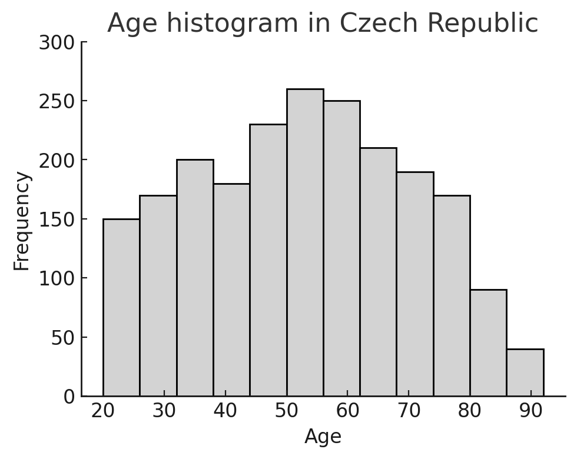
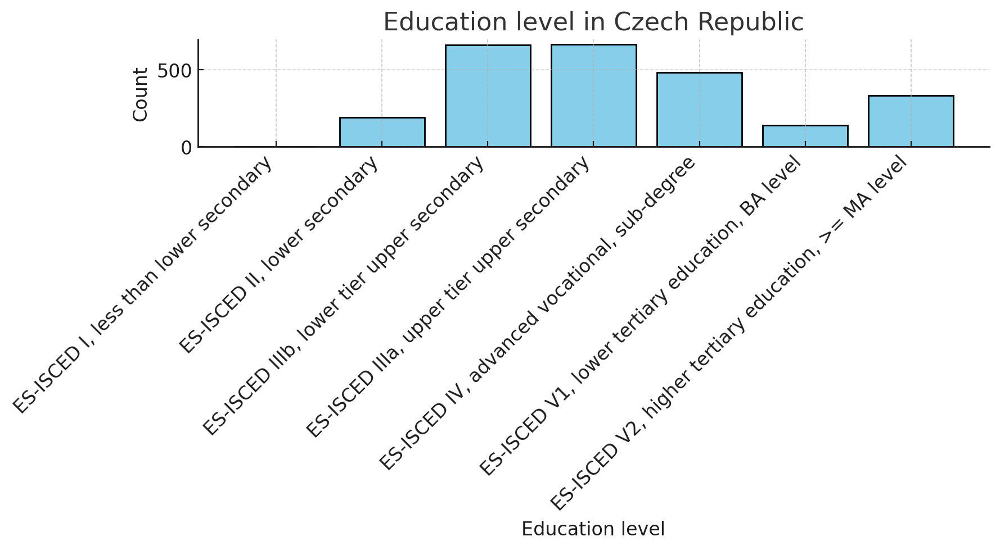
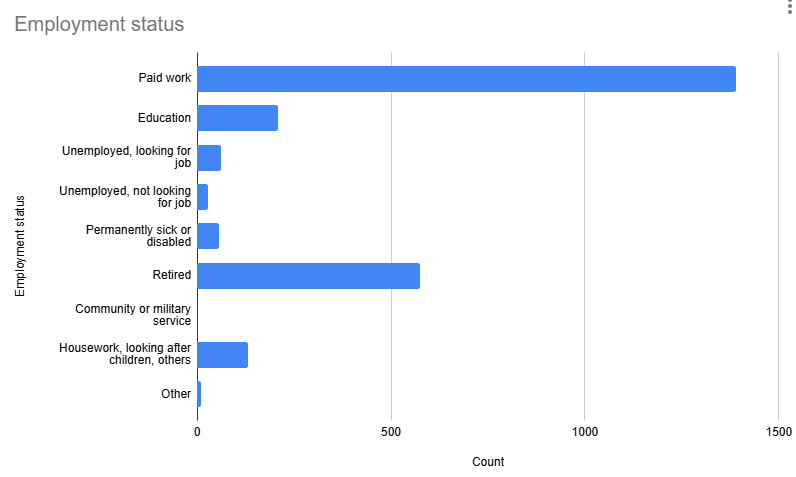
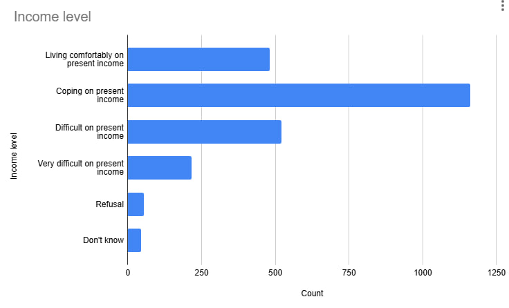
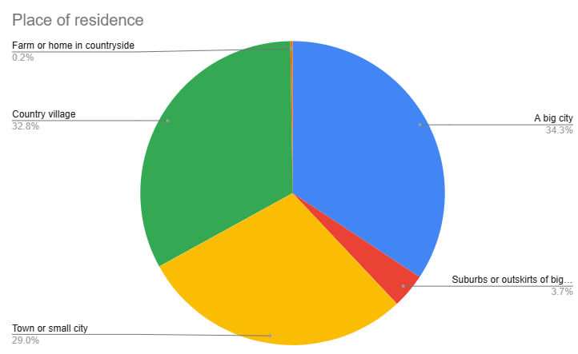
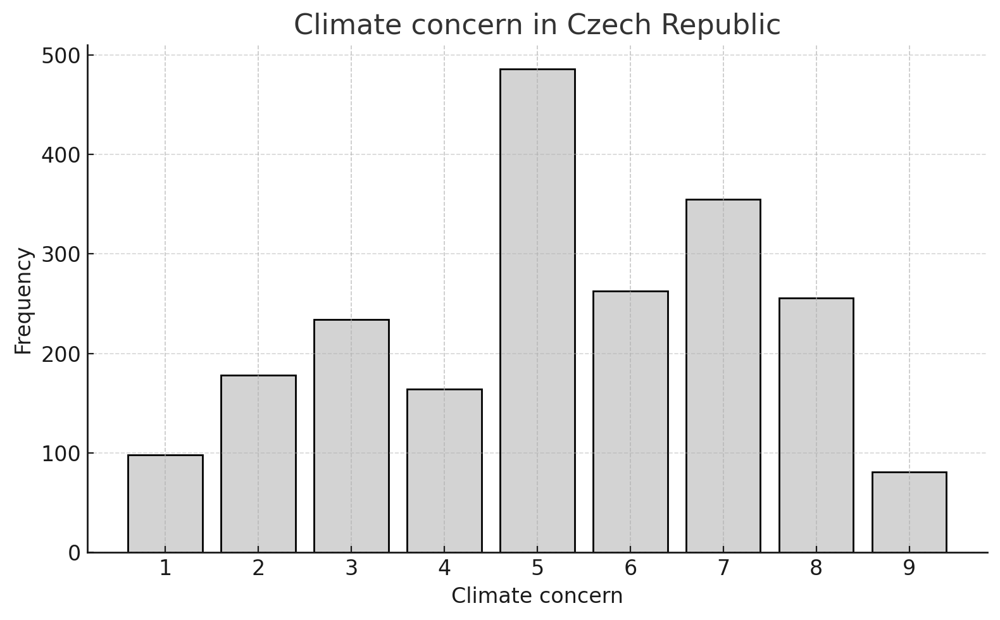
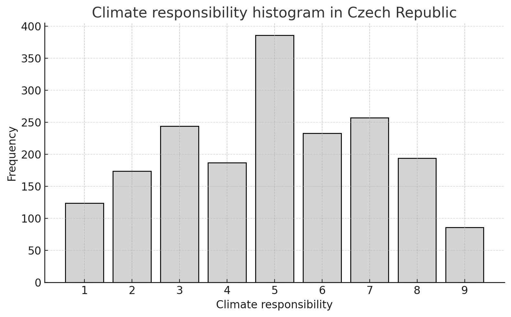
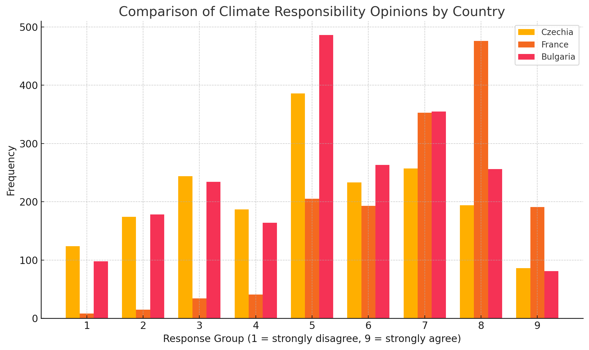

# University project

## Project's main task:

Explore and explain how different factors are connected in one specific country by using multiple linear regression.

The homework is based on the European Social Survey dataset.
[http://www.europeansocialsurvey.org/](http://www.europeansocialsurvey.org/)

## Task 1

Analyze the following relationships in the context of your chosen country:

### 1. To what extent do respondents feel a personal responsibility to try to reduce climate change?

In this research, I selected the **Czech Republic.**
The chart below shows the **age** distribution **of all survey participants**.
The **youngest** participant was **15 years old** and the **oldest was **90 years old.** The average age of all respondents was 48 years.
As we can see, **most** respondents were **between the ages of 40 and 60**. Fewer people participated in the younger (under 30) and older (over 75) age groups.

People answered questions about their education, income, and climate-related topics in the survey.

#### Education level

Below are the data about education. The information about the meaning of special symbols at the bottom is taken from:

https://github.com/MarthaBog/Climate_Impact_University/blob/main/ESS10_2020questionnaires_EE_est.pdf

Here are the education categories used:

- ES-ISCED I – Less than lower secondary education
- ES-ISCED II – Lower secondary education
- ES-ISCED IIIb – Lower tier upper secondary education
- ES-ISCED IIIa – Upper tier upper secondary education
- ES-ISCED IV – Advanced vocational or sub-degree level
- ES-ISCED V1 – Lower tertiary education, such as a Bachelor's degree
- ES-ISCED V2 – Higher tertiary education, Master's level or higher

Respondents were asked about their level of education. The bar chart below shows how many people belong to each education category:

1. Most people in the Czech Republic have completed either lower or upper tier upper secondary education (ES-ISCED IIIb and IIIa).
2. A smaller number of respondents have higher education, like Bachelor's or Master's degrees.
3. Very few people have no formal education or did not respond to the question.

#### Employment Status of respondents 

Bar chart below shows the employment status of people who took part in the survey.

- **Most respondents** are in **paid work**, meaning they have a job.
- The **second largest group** is **retired** people.
- Some respondents are in **education**, which means they are students.
- A smaller number are:

  * **Unemployed** (looking or not looking for a job)
  * **Permanently sick or disabled**
  * Doing **housework or taking care of others**
  * In **community or military service**

#### Income level of respondents 

- The **largest group** said they are **“coping on present income”**, meaning they can manage but it’s not always easy.
- Many people also said they are **“living comfortably on present income”** – they do not have big financial problems.
- Some people reported that it is **“difficult”** or **“very difficult”** to live on their income.

#### Place of Residence

- Big city – the largest group.
- Country village group has second place
- Town or small city - third place
- suburbs or outskirts of a big city - fourth place 
And only 0.2% live on a farm or in the countryside.

#### Climate Concern

Bar chart below shows how concerned people in the Czech Republic are about climate change, using a scale from 1 to 9:

**1 means “not concerned at all,”**

**9 means “extremely concerned.”**

Here’s what we can see:

1. The most common answer is 5, which suggests a neutral level of concern. 
2. A large number of people also chose 7 and 6, meaning they are fairly concerned.
3. Very few people selected 1 or 9, showing that extreme views (either not worried or very worried) are less common.

#### Climate Responsibility in the Czech Republic

This histogram shows how responsible people in the Czech Republic feel about helping to reduce climate change. The scale goes from 1 (not responsible at all) to 9 (very responsible).

1. Most people answered 5, which means many feel somewhat responsible.
2. A large number also chose 6 and 7, showing a moderate to high sense of responsibility.
3. Very few people picked 1 or 9, so extreme opinions were less common.

### 2. In addition to your selected country, compare how respondents from two other countries feel about their personal responsibility to try to reduce climate change.

This bar chart below shows how people from Czechia, France, and Bulgaria feel about their personal responsibility to fight climate change. The scale goes from 1 (strongly disagree) to 9 (strongly agree).

- **Czechia** (yellow): Most people chose the middle values like 5, 6, and 7. This means they feel neutral to somewhat responsible. Fewer chose the strongest agreement (8–9) or disagreement (1–2).
- **France** (orange): People in France were more positive. Most picked 7, 8, and 9, showing they strongly agree they have personal responsibility. France had the highest number of people choosing 8.
- **Bulgaria** (red): Responses are similar to Czechia. Many people chose 5 and 7, showing mixed but moderate agreement.

In conclusion, while all three countries show a sense of personal responsibility toward climate change, people in France express it the most strongly, whereas Czechia and Bulgaria show more moderate and balanced views.

## Task 2

How different personal factors explain whether and how a person feels a sense of personal responsibility to reduce climate change?